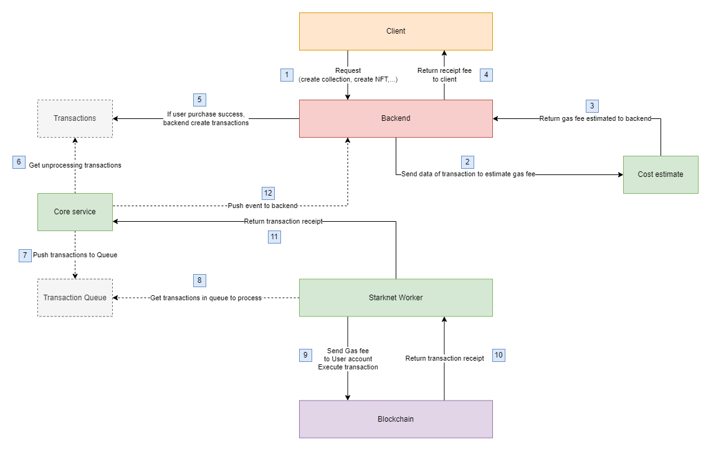

# Pikasso
## No-code NFT platform
Pikasso.xyz empowers artists, creators and game studios to unlock new markets and communities through an easy to use no-code NFT platform. We provide easy-to-use tools that allow larger audiences to enter the NFT marketplace.
### Overview
Starknet worker is used to intergrate Pikasso with Starknet network through starknet.js. 
Smart contracts written in Cairo language and used Openzepplin contracts.
### How Pikasso Works?

1. User request function such as: Create project, create collection, create NFT, transfer NFT,...
2. Request will be calculate Fee cost then return the receipt to user.
3. If users purchased success, an transaction will be create and push to queue.
4. Transaction in queue is popped and execute. 
5. User has an user account contract to interact with chain.
6. Money will be transfer to User account to execute transaction.
7. Transaction receipt will be returned to User.
### Features 
- Get transactions from transactions queue (pushed by Core service)
- Execute transactions, interact with Starknet. 
- Execute multiple calls to mint NFT.
### Events queue
- `CREATE_STARKNET_PROJECT`: 
    - Create an account contract for user.
    - Corressponding to Account contract on starknet, create an L1 (Ethereum) address
    - Deploy an ERC721 contract for user collection
- `CREATE_STARKNET_NFT`:
    -   Transfer estimated money to user account
    -   Use User account to mint NFT
- `TRANSFER_STARKNET_NFT`:
    -   User transfer NFT to another account address.
### Interaction with Starknet.js
- `create_OZ_account`: Deploy an account contract
- `setTokenURI_by_contract_owner`: Set token URI for NFT
- `transfer_by_NFT_owner`: Send NFT to another address
- `mint_with_owner`: Mint NFT for user (can user multicall to wrap multi function into 1 transaction)
- `deploy_ERC721`: Deploy an ERC721 contract
- `burn_token`: Burn an NFT
- `getTokenURI_by_contract_owner`: Get Token URI 
- `owner_multi_call`: Create an Multicall function 